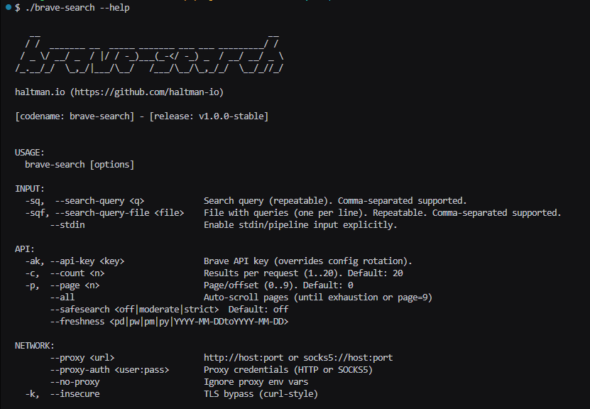
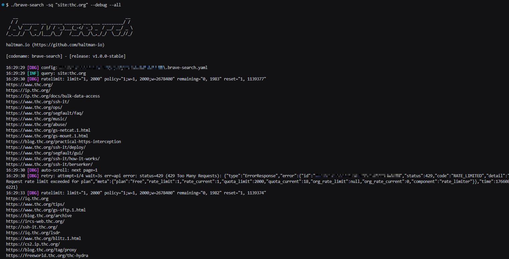
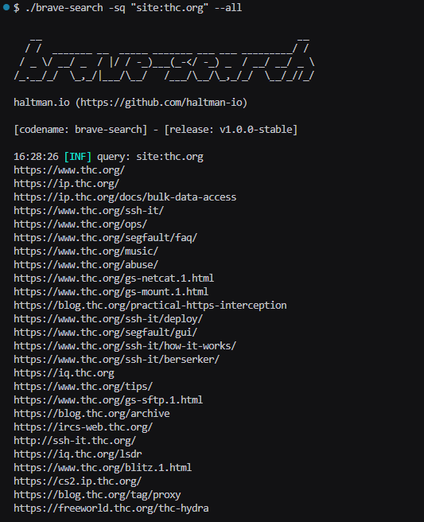
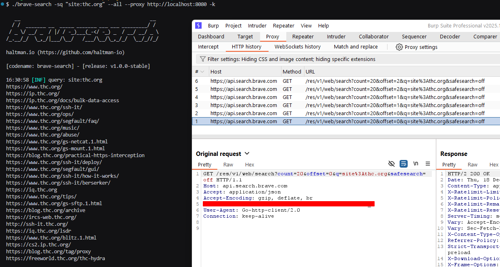

# brave-search — v1.0.0-stable

A modern, CLI tool for cybersecurity workflows that queries **Brave Search API** and extracts **URLs** from the results.
Built for Linux-first usage, with clean output, pagination support, rate limiting, retries, proxy support (HTTP / SOCKS5), and safe defaults.

---

## Screenshots & Demos

### 1) Help menu



### 2) Debug run (`site:thc.org` with `--debug`)



### 3) Pagination auto-scroll (`--all`)



### 4) Proxy run (traffic through Burp + TLS bypass `-k`)



---

## Features

* **Brave Search API Web Search**
* **Multiple query inputs**

  * `--search-query/-sq` (repeatable + comma-separated)
  * `--search-query-file/-sqf` (repeatable + comma-separated; one query per line)
  * **stdin/pipeline** only when explicitly enabled with `--stdin`
* **Pagination**

  * `--count` (1..20, default 20)
  * `--page` (0..9, default 0)
  * `--all` auto-scroll (until exhaustion or API offset max)
* **Rate limit controls**

  * `--rate-limit/-rl` (requests per second, default 5)
* **Retry on API errors**

  * `--retry-count` (default 3)
  * `--retry-wait-time` (default 3s)
  * If retries are exhausted, the tool exits with a **fatal error**
* **Proxy support**

  * HTTP/HTTPS proxy: `--proxy http://host:port`
  * SOCKS5 proxy: `--proxy socks5://host:port`
  * Optional auth: `--proxy-auth user:pass`
  * `--no-proxy` to ignore proxy env vars
* **TLS bypass**

  * `--insecure/-k` disables TLS cert verification (curl-style)
* **Multi-threading**

  * `--threads` (default 1)
* **Save results**

  * `--output/-o` saves **sorted + deduplicated** results to a file
* **Config-based API key rotation**

  * `.brave-search.yaml` in the same directory as the binary

---

## Quick Start

### 1) Build from source

```bash
git clone https://github.com/haltman-io/brave-search.git
cd brave-search

go build -o brave-search ./cmd/brave-search
```

### 2) Configure your API key

You have two options:

#### Option A — CLI flag (highest priority)

```bash
./brave-search -ak "<YOUR_API_KEY>" -sq "site:thc.org"
```

#### Option B — Config file (auto-created)

On first run, the tool ensures a config file exists **next to the executable**:

* File name: `.brave-search.yaml`
* Structure:

```yaml
api_keys: []
```

Edit it and add one or more keys:

```yaml
api_keys:
  - "KEY_1"
  - "KEY_2"
  - "KEY_3"
```

If **multiple keys** are present, each API request uses the next key in a round-robin rotation (wraps back to the first key).

---

## Usage

```bash
./brave-search --help
```

### Common examples

#### Basic search

```bash
./brave-search -sq "site:thc.org"
```

#### Debug (shows rate-limit headers and internal steps)

```bash
./brave-search -sq "site:thc.org" --debug
```

#### Multiple queries (comma-separated)

```bash
./brave-search -sq "site:thc.org,site:example.com"
```

#### Multiple queries (repeatable flags)

```bash
./brave-search -sq "site:thc.org" -sq "site:example.com"
```

#### File input (one query per line)

```bash
./brave-search -sqf queries.txt
```

#### Multiple files (repeatable or comma-separated)

```bash
./brave-search -sqf q1.txt -sqf q2.txt
./brave-search -sqf "q1.txt,q2.txt"
```

#### stdin / pipeline (must explicitly enable `--stdin`)

```bash
cat queries.txt | ./brave-search --stdin
```

#### Pagination (manual page selection)

```bash
./brave-search -sq "site:thc.org" --count 20 --page 0
./brave-search -sq "site:thc.org" --count 20 --page 1
```

#### Auto-pagination (`--all`)

```bash
./brave-search -sq "site:thc.org" --all
```

#### Save results to file (sorted + deduped)

```bash
./brave-search -sq "site:thc.org" --all -o out.txt
```

#### Use a proxy (HTTP) + TLS bypass (typical for Burp/ZAP)

```bash
./brave-search -sq "site:thc.org" --proxy http://localhost:8080 -k
```

#### SOCKS5 proxy

```bash
./brave-search -sq "site:thc.org" --proxy socks5://127.0.0.1:9050
```

---

## Flags Reference

### Input

* `--search-query <q>` / `-sq`
  Search query (repeatable). Comma-separated supported.
* `--search-query-file <file>` / `-sqf`
  File containing queries (one per line). Repeatable. Comma-separated supported.
* `--stdin`
  Enables reading queries from stdin/pipeline (**disabled by default**).

### API controls

* `--api-key <key>` / `-ak`
  API key override (highest priority).
* `--count <n>` / `-c`
  Results per request (1..20). Default: `20`.
* `--page <n>` / `-p`
  Offset/page (0..9). Default: `0`.
* `--all`
  Auto-scroll pages until exhaustion (or API offset max).
* `--safesearch <off|moderate|strict>`
  Default: `off`.
* `--freshness <pd|pw|pm|py|YYYY-MM-DDtoYYYY-MM-DD>`
  Optional.

### Rate limiting & retries

* `--rate-limit <rps>` / `-rl`
  Max requests per second (global). Default: `5`.
* `--retry-count <n>`
  Max retries on API errors. Default: `3` (attempts = 1 + retries).
* `--retry-wait-time <duration>`
  Wait time between retries. Default: `3s` (examples: `500ms`, `2s`, `1m`).

### Network

* `--proxy <url>`
  Proxy URL: `http://host:port` or `socks5://host:port`.
* `--proxy-auth <user:pass>`
  Proxy credentials (HTTP or SOCKS5).
* `--no-proxy`
  Ignore proxy environment variables.
* `--insecure` / `-k`
  Disable TLS verification (curl-style).

### Performance & output

* `--threads <n>`
  Number of worker threads. Default: `1`.
* `--output <file>` / `-o`
  Save **sorted + deduplicated** results to a file.

### Misc

* `--silent` / `-s`
  Prints **only extracted results** (URLs). No banner/logs.
* `--debug`
  Prints debug information (including rate-limit headers).
* `--version`
  Print version and exit.
* `--help` / `-h`
  Show help.

---

## Output Format

By design, output is **URL-only**, one per line:

```text
https://www.thc.org/
https://ip.thc.org/
https://www.thc.org/ssh-it/
...
```

This makes it easy to pipe results into other tooling:

```bash
./brave-search -sq "site:thc.org" --all | sort -u | tee urls.txt
```

---

## Configuration Details

### Config file location

The tool looks for `.brave-search.yaml` **in the same directory as the executable**.

### Priority rules

1. If `--api-key/-ak` is provided, it is used **always**.
2. Otherwise, `.brave-search.yaml` is loaded:

   * If `api_keys` is empty → tool exits with an error.
   * If multiple keys exist → the tool rotates keys **per request**.

---

## Notes on Rate Limits

Brave plans may enforce strict request-per-second limits (e.g. free tiers often allow **1 req/sec**).
If you see `429 RATE_LIMITED`, try:

* lowering the tool limiter:

  ```bash
  ./brave-search -sq "site:thc.org" --rate-limit 1
  ```
* increasing retry waiting time:

  ```bash
  ./brave-search -sq "site:thc.org" --retry-wait-time 5s
  ```

---

## Security Disclaimer

This tool is intended for **legal and authorized** security research and automation workflows.
You are responsible for complying with Brave’s API terms and any applicable laws/regulations.

---

## License

This project is licensed under the Unlicense, see the [LICENSE](LICENSE) file for details.
